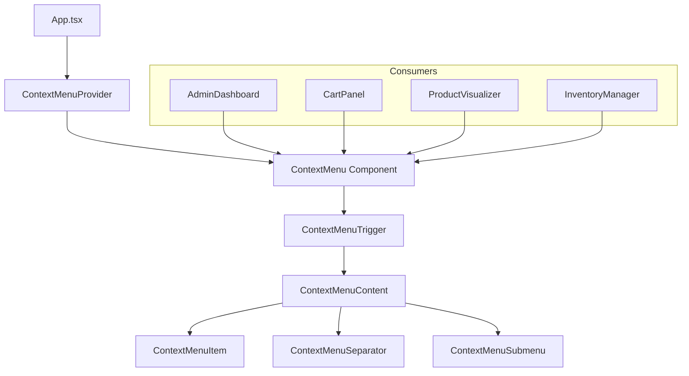
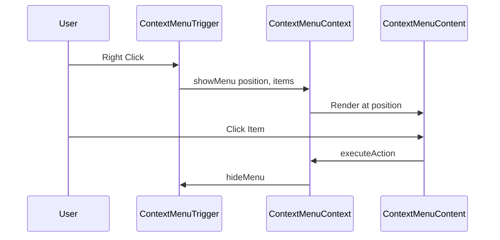

# Plan: Sistema de Menú Contextual (Right-Click Menu)

## Resumen

Implementar un sistema de menú contextual reutilizable usando React + Tailwind CSS sin dependencias externas. El sistema permitirá acciones como eliminar, copiar, mover, editar, etc. en múltiples lugares de la aplicación.

---

## Arquitectura del Sistema

### Diagrama de Componentes



### Flujo de Datos



---

## Estructura de Archivos

```
components/
├── ContextMenu/
│   ├── ContextMenu.tsx          # Componente principal
│   ├── ContextMenuTrigger.tsx   # HOC para envolver elementos
│   ├── ContextMenuItem.tsx      # Item individual del menú
│   ├── ContextMenuSeparator.tsx # Separador visual
│   └── index.ts                 # Exports

contexts/
├── ContextMenuContext.tsx       # Estado global del menú

types.ts                         # Agregar tipos de ContextMenu
```

---

## Interfaces y Tipos

### ContextMenuItem

```typescript
interface ContextMenuItem {
  id: string;
  label: string;
  icon?: React.ReactNode;
  shortcut?: string;           // Ej: Ctrl+C, Delete
  disabled?: boolean;
  danger?: boolean;            // Para acciones destructivas - rojo
  onClick?: () => void;
  submenu?: ContextMenuItem[]; // Submenús anidados
}

interface ContextMenuState {
  isOpen: boolean;
  position: { x: number; y: number };
  items: ContextMenuItem[];
  targetData?: any;            // Datos del elemento objetivo
}

interface ContextMenuContextType {
  state: ContextMenuState;
  showMenu: (position: { x: number; y: number }, items: ContextMenuItem[], targetData?: any) => void;
  hideMenu: () => void;
}
```

---

## Componentes Detallados

### 1. ContextMenuContext.tsx

**Responsabilidad:** Manejar el estado global del menú contextual

**Funciones:**
- `showMenu(position, items, targetData)` - Mostrar menú en posición
- `hideMenu()` - Ocultar menú
- Estado: `{ isOpen, position, items, targetData }`

### 2. ContextMenu.tsx

**Responsabilidad:** Renderizar el menú en el portal

**Características:**
- Renderizado en portal para evitar overflow
- Posicionamiento inteligente (no salir de viewport)
- Animación de entrada/salida
- Cerrar al hacer click fuera
- Cerrar con tecla Escape
- Navegación con flechas del teclado

### 3. ContextMenuTrigger.tsx (HOC)

**Responsabilidad:** Envolver elementos para activar el menú

**Uso:**
```tsx
<ContextMenuTrigger
  items={menuItems}
  data={orderData}
>
  <OrderCard order={order} />
</ContextMenuTrigger>
```

### 4. ContextMenuItem.tsx

**Responsabilidad:** Renderizar cada opción del menú

**Características:**
- Icono opcional
- Atajo de teclado visual
- Estado disabled
- Estilo danger para acciones destructivas
- Soporte para submenús

---

## Integraciones por Componente

### AdminDashboard - Órdenes

| Acción | Descripción | Icono |
|--------|-------------|-------|
| Editar | Abrir modal de edición | Edit |
| Duplicar | Crear copia de la orden | Copy |
| Cambiar Estado | Submenú con estados | ArrowRight |
| Enviar WhatsApp | Abrir chat con cliente | MessageCircle |
| Imprimir | Generar PDF/impresión | Printer |
| Marcar Prioridad | Toggle prioridad | Star |
| --- | Separador | --- |
| Eliminar | Eliminar orden | Trash2 |

### AdminDashboard - Productos

| Acción | Descripción | Icono |
|--------|-------------|-------|
| Editar | Abrir editor de producto | Edit |
| Duplicar | Crear copia del producto | Copy |
| Ajustar Stock | Modal de ajuste de inventario | Package |
| Cambiar Categoría | Submenú de categorías | Tag |
| --- | Separador | --- |
| Desactivar | Desactivar producto | EyeOff |
| Eliminar | Eliminar producto | Trash2 |

### AdminDashboard - Clientes

| Acción | Descripción | Icono |
|--------|-------------|-------|
| Ver Perfil | Abrir perfil completo | UserCircle |
| Nueva Orden | Crear orden para cliente | Plus |
| Ver Historial | Ver órdenes anteriores | History |
| Enviar WhatsApp | Contactar cliente | MessageCircle |
| Ajustar Puntos | Modificar Laser Points | Gift |
| --- | Separador | --- |
| Eliminar | Eliminar cliente | Trash2 |

### CartPanel - Items del Carrito

| Acción | Descripción | Icono |
|--------|-------------|-------|
| Editar Diseño | Abrir customizer | Edit |
| Duplicar | Crear copia del item | Copy |
| Mover Arriba | Reordenar | ArrowUp |
| Mover Abajo | Reordenar | ArrowDown |
| --- | Separador | --- |
| Eliminar | Quitar del carrito | Trash2 |

### ProductVisualizer - Elementos de Diseño

| Acción | Descripción | Icono |
|--------|-------------|-------|
| Editar | Modificar texto/logo | Edit |
| Duplicar | Crear copia | Copy |
| Traer al Frente | Capa superior | Layers |
| Enviar al Fondo | Capa inferior | Layers |
| Alinear | Submenú de alineación | AlignLeft |
| --- | Separador | --- |
| Eliminar | Quitar elemento | Trash2 |

---

## Estilos CSS

### Clases de Tailwind

```css
/* Contenedor del menú */
.context-menu {
  @apply fixed z-50 min-w-[180px] max-w-[280px] 
         bg-white dark:bg-zinc-800 
         rounded-lg shadow-xl border 
         border-zinc-200 dark:border-zinc-700
         py-1 animate-in fade-in slide-in-from-top-2;
}

/* Item del menú */
.context-menu-item {
  @apply flex items-center gap-3 px-3 py-2 
         text-sm text-zinc-700 dark:text-zinc-200
         hover:bg-zinc-100 dark:hover:bg-zinc-700
         cursor-pointer transition-colors;
}

/* Item deshabilitado */
.context-menu-item:disabled {
  @apply opacity-50 cursor-not-allowed;
}

/* Item peligroso */
.context-menu-item.danger {
  @apply text-red-600 dark:text-red-400 
         hover:bg-red-50 dark:hover:bg-red-900/20;
}

/* Separador */
.context-menu-separator {
  @apply h-px bg-zinc-200 dark:bg-zinc-700 my-1;
}

/* Atajo de teclado */
.context-menu-shortcut {
  @apply ml-auto text-xs text-zinc-400 dark:text-zinc-500;
}
```

---

## Consideraciones de Accesibilidad

1. **Navegación por teclado:**
   - Arrow Up/Down para navegar items
   - Enter para seleccionar
   - Escape para cerrar
   - Arrow Right para abrir submenú

2. **ARIA Attributes:**
   - `role="menu"` en el contenedor
   - `role="menuitem"` en cada item
   - `aria-disabled` para items deshabilitados
   - `aria-haspopup` para submenús

3. **Focus Management:**
   - Auto-focus al primer item al abrir
   - Focus trap dentro del menú
   - Restaurar focus al cerrar

---

## Ejemplo de Uso

```tsx
import { ContextMenuTrigger } from '../components/ContextMenu';
import { Edit, Copy, Trash2, MessageCircle } from 'lucide-react';

const OrderCard = ({ order, onEdit, onDuplicate, onDelete, onWhatsApp }) => {
  const menuItems = [
    {
      id: 'edit',
      label: 'Editar',
      icon: <Edit size={16} />,
      onClick: () => onEdit(order)
    },
    {
      id: 'duplicate',
      label: 'Duplicar',
      icon: <Copy size={16} />,
      onClick: () => onDuplicate(order)
    },
    {
      id: 'whatsapp',
      label: 'Enviar WhatsApp',
      icon: <MessageCircle size={16} />,
      onClick: () => onWhatsApp(order)
    },
    { id: 'separator', label: '---' },
    {
      id: 'delete',
      label: 'Eliminar',
      icon: <Trash2 size={16} />,
      danger: true,
      onClick: () => onDelete(order.id)
    }
  ];

  return (
    <ContextMenuTrigger items={menuItems} data={order}>
      <div className="order-card">
        {/* Contenido de la tarjeta */}
      </div>
    </ContextMenuTrigger>
  );
};
```

---

## Tareas de Implementación

### Fase 1: Infraestructura Base
- [ ] Crear tipos en `types.ts`
- [ ] Crear `ContextMenuContext.tsx`
- [ ] Crear componente `ContextMenu.tsx`
- [ ] Crear `ContextMenuItem.tsx`
- [ ] Crear `ContextMenuSeparator.tsx`
- [ ] Crear `ContextMenuTrigger.tsx`
- [ ] Crear archivo `index.ts` con exports

### Fase 2: Integración
- [ ] Integrar en AdminDashboard - Órdenes
- [ ] Integrar en AdminDashboard - Productos
- [ ] Integrar en AdminDashboard - Clientes
- [ ] Integrar en CartPanel
- [ ] Integrar en ProductVisualizer
- [ ] Integrar en InventoryManager

### Fase 3: Refinamiento
- [ ] Agregar animaciones CSS
- [ ] Implementar navegación por teclado
- [ ] Agregar atributos ARIA
- [ ] Probar en móvil (long press)
- [ ] Documentar uso en AGENTS.md

---

## Notas Adicionales

- El menú debe cerrarse automáticamente al hacer scroll
- Considerar soporte para long-press en dispositivos táctiles
- El posicionamiento debe evitar que el menú salga del viewport
- Los submenús deben abrirse hacia la izquierda si no hay espacio a la derecha
