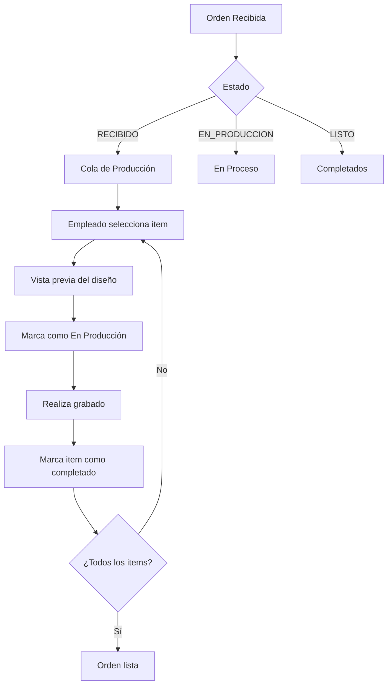

# Diseño: Sección de Producción para Empleado de Grabado Láser

## Resumen

Crear una nueva sección en el AdminDashboard específicamente diseñada para el empleado que realiza el grabado láser. Esta sección debe mostrar **solo la información necesaria para producir** sin distracciones financieras, enfocándose en la calidad y precisión del trabajo.

---

## Requisitos Clave

### Información que SÍ necesita el empleado:
- ✅ Producto y color específico
- ✅ Texto a grabar (frente y dorso)
- ✅ Fuente tipográfica a usar
- ✅ Posición del texto (coordenadas x, y, escala, rotación)
- ✅ Logos/imágenes a grabar
- ✅ Cantidad de unidades
- ✅ Notas especiales del cliente
- ✅ Vista previa visual del diseño
- ✅ Instrucciones de producción
- ✅ Orden de trabajo secuencial

### Información que NO necesita:
- ❌ Precios ($$$)
- ❌ Estado de pago
- ❌ Método de pago
- ❌ Descuentos aplicados
- ❌ Datos financieros del cliente

---

## Arquitectura de la Solución

### 1. Nuevo Tipo de Pestaña

```typescript
// En types.ts - Actualizar AdminDashboardProps
activeTab?: 'DASHBOARD' | 'ORDERS' | 'PRODUCTION' | 'INVENTORY' | 'SETTINGS' | 'FONTS' | 'CLIENTS' | 'FINANCE' | 'GALERIA' | 'CALENDAR' | 'CONTENT';
```

### 2. Estructura del Componente

```
ProductionSection/
├── Header
│   ├── Título: "Estación de Grabado"
│   ├── Filtro por estado (Pendiente/En Proceso/Completado)
│   └── Contador de items pendientes
├── ProductionQueue (Lista de trabajo)
│   ├── ProductionCard (por cada item)
│   │   ├── Producto + Color
│   │   ├── Vista previa visual
│   │   ├── Texto y fuente
│   │   ├── Cantidad
│   │   ├── Notas especiales
│   │   └── Acciones (Iniciar/Completar)
│   └── ...
└── ProductionDetail (Vista expandida)
    ├── Visualizador grande del diseño
    ├── Especificaciones técnicas
    ├── Instrucciones paso a paso
    └── Checklist de completado
```

### 3. Flujo de Trabajo



---

## Diseño de UI/UX

### Vista Principal - Cola de Producción

```
┌─────────────────────────────────────────────────────────────────┐
│  🔧 ESTACIÓN DE GRABADO                    [Pendientes: 12]     │
├─────────────────────────────────────────────────────────────────┤
│  Filtros: [Todos] [Pendientes] [En Proceso] [Completados Hoy]   │
├─────────────────────────────────────────────────────────────────┤
│                                                                 │
│  ┌─────────────────────────────────────────────────────────┐   │
│  │ #1  YETI Rambler 30oz - Negro Mate                      │   │
│  │ ┌──────────┐  Texto Frente: "María García"              │   │
│  │ │  VISTA   │  Fuente: Montserrat Bold                   │   │
│  │ │  PREVIA  │  Logo: Logo empresa (esquina inferior)     │   │
│  │ │          │  Cantidad: 2 unidades                      │   │
│  │ └──────────┘  ⚠️ Nota: "Grabar más pequeño de lo normal"│   │
│  │                                                         │   │
│  │  [▶ Iniciar Grabado]  [✓ Marcar Completado]            │   │
│  └─────────────────────────────────────────────────────────┘   │
│                                                                 │
│  ┌─────────────────────────────────────────────────────────┐   │
│  │ #2  Stanley Quencher 40oz - Rosa Pastel                 │   │
│  │ ┌──────────┐  Texto Frente: "Cumpleaños Sofia 🎂"       │   │
│  │ │  VISTA   │  Texto Dorso: "15 años"                    │   │
│  │ │  PREVIA  │  Fuente: Great Vibes (cursiva)             │   │
│  │ │          │  Cantidad: 1 unidad                        │   │
│  │ └──────────┘                                           │   │
│  │                                                         │   │
│  │  [▶ Iniciar Grabado]  [✓ Marcar Completado]            │   │
│  └─────────────────────────────────────────────────────────┘   │
│                                                                 │
└─────────────────────────────────────────────────────────────────┘
```

### Vista Detallada - Modo Enfoque

```
┌─────────────────────────────────────────────────────────────────┐
│  ← Volver a Cola                    YETI Rambler 30oz - Negro   │
├─────────────────────────────────────────────────────────────────┤
│                                                                 │
│  ┌─────────────────────────────────────────────────────────┐   │
│  │                                                         │   │
│  │                    VISTA PREVIA GRANDE                  │   │
│  │                                                         │   │
│  │              [Producto con diseño superpuesto]          │   │
│  │                                                         │   │
│  │                                                         │   │
│  └─────────────────────────────────────────────────────────┘   │
│                                                                 │
│  ┌──────────────────────┐  ┌──────────────────────────────┐    │
│  │ ESPECIFICACIONES     │  │ INSTRUCCIONES                │    │
│  │                      │  │                              │    │
│  │ Texto: "María García"│  │ 1. Colocar producto en...    │    │
│  │ Fuente: Montserrat   │  │ 2. Ajustar láser a...        │    │
│  │ Tamaño: 24pt         │  │ 3. Verificar posición...     │    │
│  │ Posición X: 50%      │  │                              │    │
│  │ Posición Y: 45%      │  │ ⚠️ Nota cliente: "Grabar     │    │
│  │ Rotación: 0°         │  │    más pequeño"              │    │
│  │ Cantidad: 2 unidades │  │                              │    │
│  └──────────────────────┘  └──────────────────────────────┘    │
│                                                                 │
│  ┌─────────────────────────────────────────────────────────┐   │
│  │ CHECKLIST DE CALIDAD                                     │   │
│  │ ☐ Texto correctamente posicionado                        │   │
│  │ ☐ Logo alineado                                          │   │
│  │ ☐ Sin errores ortográficos                               │   │
│  │ ☐ Profundidad de grabado correcta                        │   │
│  └─────────────────────────────────────────────────────────┘   │
│                                                                 │
│           [✓ MARCAR COMO COMPLETADO]                           │
│                                                                 │
└─────────────────────────────────────────────────────────────────┘
```

---

## Datos Técnicos

### Interface ProductionItem

```typescript
interface ProductionItem {
  // Identificación
  orderId: string;
  orderItemId: string;
  sequenceNumber: number;
  
  // Producto
  productName: string;
  productBrand: ProductBrand;
  colorName: string;
  colorHex: string;
  productImageUrl: string;
  
  // Diseño - Frente
  frontText: string;
  frontText2?: string;
  frontFontName: string;
  frontFontCssFamily: string;
  frontDesignState: DesignState;
  frontLogos: LogoItem[];
  
  // Diseño - Dorso
  backText: string;
  backText2?: string;
  backFontName?: string;
  backFontCssFamily?: string;
  backDesignState: DesignState;
  backLogos: LogoItem[];
  
  // Producción
  quantity: number;
  notes?: string;
  specialInstructions?: string;
  
  // Estado
  productionStatus: 'PENDING' | 'IN_PROGRESS' | 'COMPLETED';
  startedAt?: string;
  completedAt?: string;
}
```

### Función de Transformación

```typescript
// Convierte Order + OrderItem a ProductionItem
function orderToProductionItems(order: Order, products: Product[]): ProductionItem[] {
  return order.items.map((item, index) => {
    const product = products.find(p => p.id === item.productId);
    const color = product?.colors.find(c => c.name === item.colorName);
    
    return {
      orderId: order.id,
      orderItemId: item.id,
      sequenceNumber: index + 1,
      
      productName: product?.name || 'Producto desconocido',
      productBrand: product?.brand || ProductBrand.OTHER,
      colorName: item.colorName,
      colorHex: color?.hex || '#000000',
      productImageUrl: product?.imageUrl || '',
      
      frontText: item.frontText,
      frontText2: item.frontText2,
      frontFontName: item.frontFontName,
      frontFontCssFamily: getFontCssFamily(item.frontFontId),
      frontDesignState: item.frontDesignState,
      frontLogos: item.frontLogos,
      
      backText: item.backText,
      backFontName: item.backFontName,
      backDesignState: item.backDesignState,
      backLogos: item.backLogos,
      
      quantity: item.quantity,
      notes: item.notes,
      
      productionStatus: order.status === OrderStatus.IN_PRODUCTION 
        ? 'IN_PROGRESS' 
        : 'PENDING'
    };
  });
}
```

---

## Integración con AdminDashboard

### Cambios en el Sidebar

```typescript
// Agregar nuevo item al menú lateral
{ id: 'PRODUCTION', label: 'Producción', icon: Zap, 
  badge: pendingProductionItems.length > 0 ? pendingProductionItems.length : null }
```

### Posición en el Menú

El orden sugerido es:
1. Dashboard
2. **Producción** ← Nueva sección
3. Órdenes (para admin completo)
4. Calendario
5. Inventario
6. Clientes
7. Fonts
8. Galería
9. Contenido
10. Ajustes

---

## Funcionalidades Adicionales

### 1. Filtros Inteligentes
- Por estado de producción
- Por tipo de producto
- Por fecha de entrega
- Prioridad

### 2. Acciones Rápidas
- Iniciar grabado (cambia estado a EN_PRODUCCIÓN)
- Marcar como completado
- Reportar problema (agrega nota interna)
- Ver orden completa (para contexto)

### 3. Notificaciones
- Alerta de items prioritarios
- Recordatorio de fechas de entrega
- Contador de items pendientes

### 4. Vista de Calidad
- Checklist pre-completado
- Espacio para notas de producción
- Historial de grabados del día

---

## Consideraciones de Implementación

### Estado Local vs Global
- El estado de producción se deriva de `Order.status`
- No se necesita nuevo estado global
- Los cambios se propagan via `onUpdateOrder`

### Persistencia
- Los cambios se guardan en el historial de la orden
- Se registra quién completó cada item
- Timestamp de inicio y fin de grabado

### Permisos
- Esta sección es para empleados de producción
- No requiere permisos de admin
- Puede ser un rol separado: `UserRole.OPERATOR`

---

## Próximos Pasos

1. Crear componente `ProductionSection.tsx`
2. Implementar transformación de órdenes a items de producción
3. Diseñar UI de la cola de producción
4. Integrar vista previa visual (reutilizar ProductVisualizer)
5. Agregar funcionalidad de completado
6. Actualizar menú lateral del AdminDashboard
7. Probar flujo completo de producción

---

## Archivos a Modificar

| Archivo | Cambio |
|---------|--------|
| `types.ts` | Agregar tipo `ProductionItem` y actualizar `activeTab` |
| `components/AdminDashboard.tsx` | Agregar nueva pestaña y sección |
| `components/ProductionSection.tsx` | Nuevo componente principal |
| `components/ProductionCard.tsx` | Tarjeta individual de item |
| `components/ProductionDetail.tsx` | Vista detallada expandida |

---

*Documento creado: 2026-02-25*
*Proyecto: LaserMachine V4.1a*
